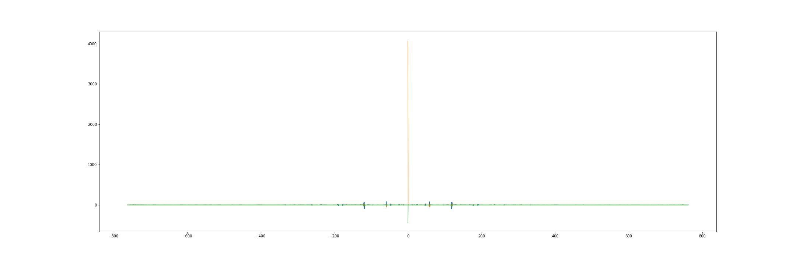

# Accelerometer data reader


It reads the data from an accelerometer stored in a .txt file, 
and exports a .txt file with the data in the frequency domain, through the FFT.

The input file name must be:

(Start Epoch)-(Collection Duration in milliseconds)-(Sensor ID).txt

# Running

````
$ .\fft-accelerometer\accelerometer-fftw.exe [filename.txt]
````

# Results

- output.txt

# How to view data
Graphic creation is done by python 3.8.

## Preparing Python to Generate the Graph

Create a virtual environment:
````
$ python -m venv venv
````

Start the virtual environment(cmd):
````
$ .\venv\Scripts\activate.bat
````

Install modules:
````
$ pip install -r .\fft-accelerometer\requirements.txt
````

## Generating the graph

````
$ python .\fft-accelerometer\plot-fftw.py
````

# Graphic


